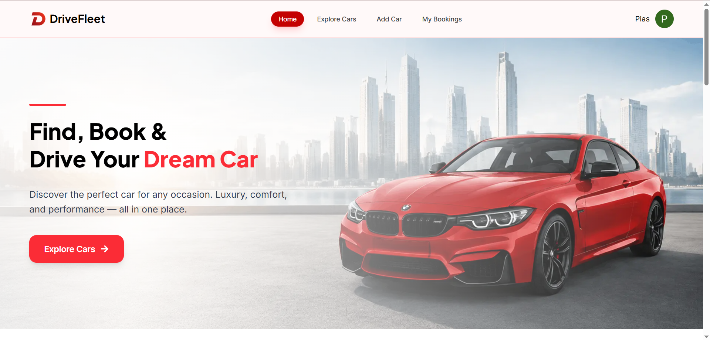
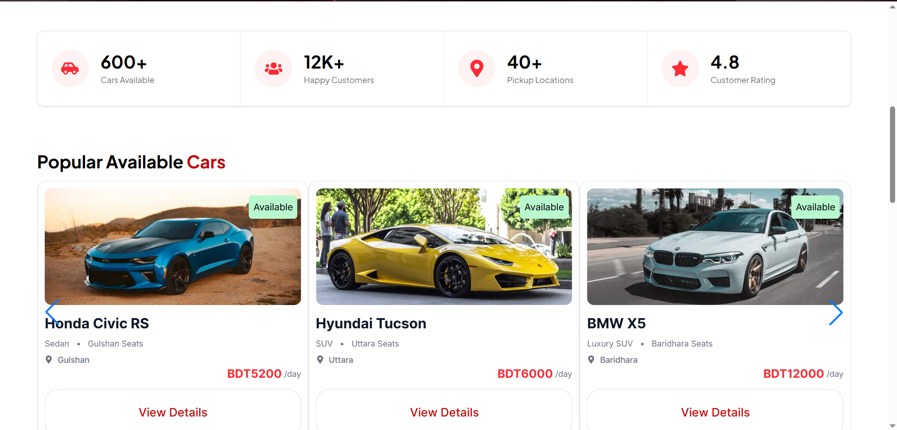
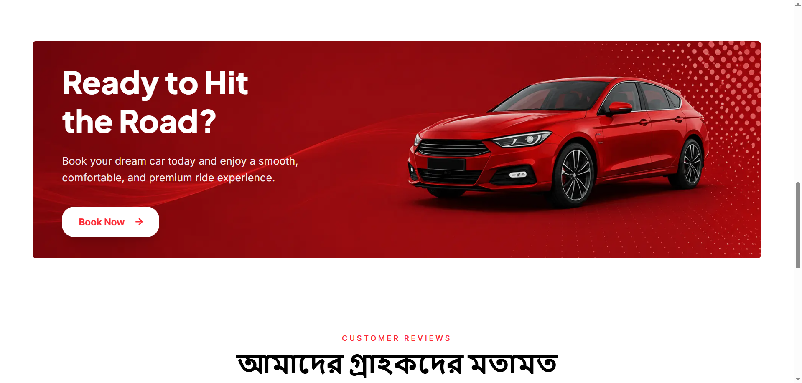
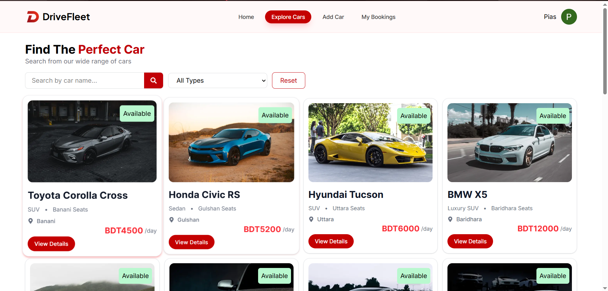
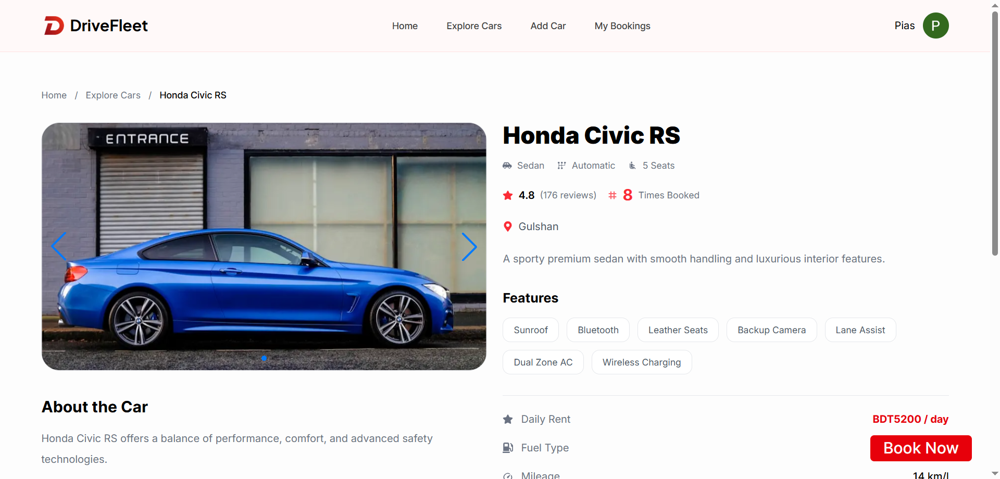

# 🚗 DriveFleet - Car Rental Platform

DriveFleet is a modern full-stack car rental platform where users can explore available cars, book rentals, manage bookings, and add their own car listings. The project focuses on secure authentication, smooth booking management, and a clean responsive user interface.

---

# 🌐 Live Website

🔗 https://drive-fleet-a09-client.vercel.app

---

# 📂 GitHub Repositories

## Client-side Repository
🔗 https://github.com/piasmajumdar/drive-fleet-a09-client

## Server-side Repository
🔗 https://github.com/piasmajumdar/drive-fleet-a09-server

---

# ✨ Features

- 🔐 Secure Authentication with Firebase & JWT
- 🚘 Explore available cars with dynamic search and filter
- 📅 Book rental cars with booking management system
- 🛠️ Add, Update, and Delete car listings
- 📈 Booking count increment system using MongoDB `$inc`
- 🍪 JWT token stored in HTTPOnly cookies
- ⚡ Protected private routes and APIs
- 📱 Fully responsive for mobile, tablet, and desktop
- 🎨 Modern UI using HeroUI, GravityUI, and TailwindCSS
- 🔔 Toast notifications using React Toastify
- 🚫 Custom 404 Not Found page
- ⏳ Loading spinner during data fetching

---

# 🛠️ Technologies Used

## Frontend
- Next.js
- React.js
- Tailwind CSS
- HeroUI
- Gravity UI
- Swiper JS
- React Toastify
- React Icons
- Firebase Authentication

## Backend
- Node.js
- Express.js
- MongoDB
- JWT Authentication
- Cookie Parser
- CORS
- dotenv

## Deployment
- Vercel
- Render

---


# 📦 NPM Packages Used

## Frontend Packages

```bash
npm install @heroui/react
npm install @gravity-ui/uikit
npm install swiper
npm install react-toastify
npm install react-icons
npm install axios
```

---

## Backend Packages

```bash
npm install express mongodb cors dotenv jsonwebtoken cookie-parser
```

---

# 🚀 Installation & Setup

## Clone Client Repository

```bash
git clone https://github.com/piasmajumdar/drive-fleet-a09-client
```

## Clone Server Repository

```bash
git clone https://github.com/piasmajumdar/drive-fleet-a09-server
```

---

## Install Dependencies

```bash
npm install
```

---

## Run Client

```bash
npm run dev
```

---

## Run Server

```bash
npm start
```

---

# 🔐 Authentication Features

- Email & Password Login
- User Registration
- Google Authentication
- Password Validation
- JWT Protected APIs
- HTTPOnly Cookie Authentication

---

# 🚘 Main Functionalities

## Public Routes

- Home Page
- Explore Cars Page
- Car Details Page
- Login Page
- Register Page

---

## Private Routes

- Add Car
- My Bookings
- My Added Cars
- Update Car
- Delete Car

---

# 🔎 Search & Filter System

Users can:

- Search cars by name using MongoDB `$regex`
- Filter cars by type/category
- View available and unavailable cars

---

# 📅 Booking System

Users can:

- Book cars
- Add special notes
- Choose driver requirement
- View booking history
- Manage bookings easily

---

# 🎨 UI Features

- Modern Responsive Design
- Consistent Typography & Spacing
- Interactive Car Sliders using Swiper JS
- Smooth User Experience
- Clean Recruiter-Friendly Interface

---

# 📱 Responsiveness

The website is optimized for:

- 📱 Mobile Devices
- 💻 Tablets
- 🖥️ Desktop Screens

---

# ⚠️ Important Notes

- Secure MongoDB credentials with environment variables
- No default browser alerts used
- Proper CORS configuration implemented
- Reloading private routes works correctly
- Responsive on all screen sizes

---

# Screenshots






---


# 👨‍💻 Developer

Developed by Pias Majumdar

---

# 📜 License

This project is created for educational purposes.